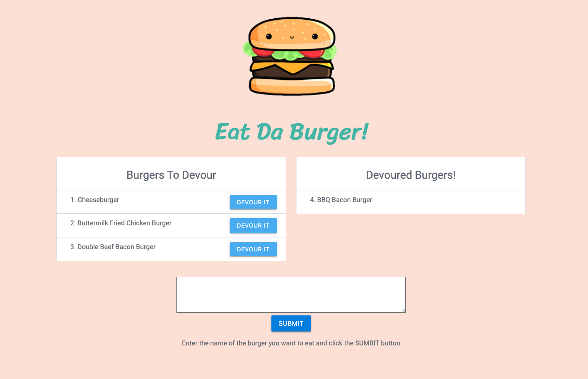

# Burger-Record


## Description

An app which allows users to input burger names they'd like to eat and keep track of the ones they've already devoured.

## Table of Contents

* [Installation](#installation)
* [Usage](#usage)
* [License](#license)
* [Questions](#questions)

## Installation

To install the necessary dependencies, run the following command:

```
npm i
```

## Usage



Fill out the database info in the `config/connection.js` file. Then run the following code in the Terminal or Git Bash to start the server:
```
node server.js
```
Click the following link to see the deployed version on Heroku!
https://shrouded-bayou-18775.herokuapp.com/

## License

This project is licensed under the MIT license.

## Questions

If you have any questions about the repo, open an issue or want to discuss, contact me directly at anna.s.chong@gmail.com. You can find more of my work at [acho9138](https://github.com/acho9138/.).

## Credits

Thank you to the following resources to help make this app possible:

- The Coding Bootcamp at University of Sydney
- MDN
- Stack Overflow
- Node.js
- Materialize CSS
- Heroku
- Google Fonts
- [Giphy](https://giphy.com/stickers/fast-food-fastfood-hambrguer-iIwdE2XoD53ihH7LKY)